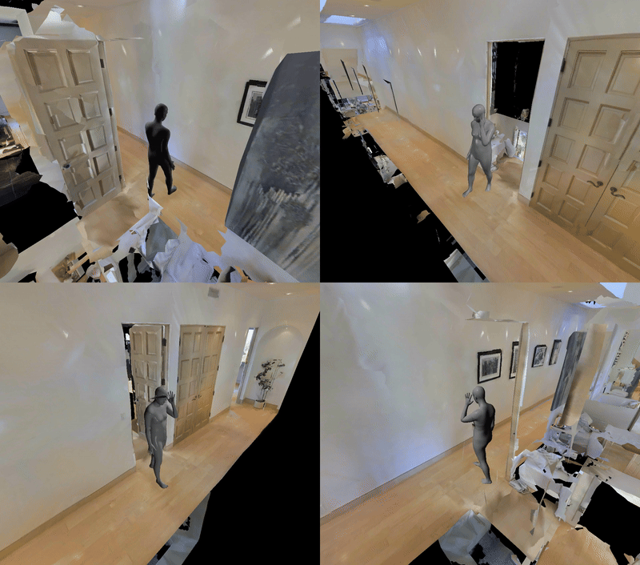
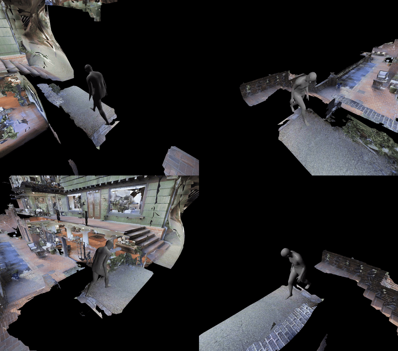

# Multi-human Annotations for HA-VLN-CE Simulator
🚀🚀🚀 [**Download Here**](https://www.dropbox.com/scl/fo/ynqzn0hp7n1q961s83hs8/AF6yoNbZAGypEk4HHegt_TQ?rlkey=t2y9vofke6apkebnucqx2pk43&st=hvmke70h&dl=0)

**We present several annotated instances of human subjects (Overall and single), showcasing a variety of well-aligned motions, movements, and interations.** 

  

**Overall View of Nine Annoated Scenarios from HA-VLN Simulator (90 scans in total)** 

  

**Single Humans with Movements (910 Humans in total)** 

Demo 1|Demo 2|Demo 3
--|--|--
||

Demo 4|Demo 5|Demo 6
--|--|--
||
