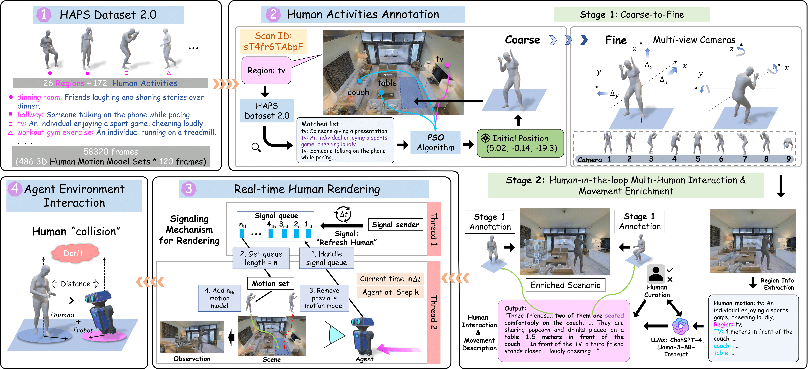

# HA-VLN-CE

## Overall View

  

Vision-and-Language Navigation (VLN) is crucial for enabling robots to assist humans in everyday environments. However, current VLN systems lack social awareness and rely on simplified instructions with static environments, limiting Sim2Real realizations. To narrow these gaps, we present Human-Aware Vision-and-Language Navigation (**HA-VLN**), expanding VLN to include both discrete (HA-VLN-DE) and continuous (HA-VLN-CE) environments with social behaviors. The HA-VLN Simulator enables real-time rendering of human activities and provides unified environments for navigation development. It introduces the Human Activity and Pose Simulation (HAPS) Dataset 2.0 with detailed 3D human motion models and the HA Room-to-Room (HA-R2R) Dataset with complex navigation instructions that include human activities. We propose an HA-VLN Vision-and-Language model (HA-VLN-VL) and a Cross-Model Attention model (HA-VLN-CMA) to address visual-language understanding and dynamic decision-making challenges. Comprehensive evaluations and analysis show that dynamic environments with human activities significantly challenge current systems, highlighting the need for specialized human-aware navigation systems for real-world deployment.

## HA-VLN-CE Simulator

  

**HA-VLN-CE** simulator incorporates dynamic human activities into photorealistic Habitat environments. The annotation process includes: 1). integrating the [HAPS 2.0 dataset](https://www.dropbox.com/scl/fo/6ofhh9vw5h21is38ahhgc/AOutW4EK3higqNOrX2hQ8rk?rlkey=v88np78ugr49z3sqisnvo6a9i&st=xogu3trq&dl=0) with 172 activities and 486 detailed 3D motion models across 58,320 frames; 2). a two-stage annotation—Stage 1: coarse-to-fine using PSO algorithm and multi-view cameras, and Stage 2: human-in-the-loop for enhancing multi-human interactions and movements; 3). real-time rendering using a signaling mechanism; and 4). enabling agent-environment interactions.

**We present several annotated instances of human subjects from the proposed HAPS 2.0 Dataset (Overall and single), showcasing a variety of well-aligned motions, movements, and interations.** 

  

**Overall View of Nine Annoated Scenarios from HA-VLN Simulator (90 scans in total)** 

  

**Single Humans with Movements (910 Humans in total)** 

Demo 1|Demo 2|Demo 3
--|--|--
||

Demo 4|Demo 5|Demo 6
--|--|--
||

## Navigation Visualization

Navigation Demo 1|Navigation Demo 2
--|--
|
**Navigation Instruction**: Start by moving forward in the lounge area, where an individual is engaged in a phone conversation while pacing back and forth. Navigate carefully to avoid crossing their path. As you proceed, you will pass by a television mounted on the wall. Continue your movement, observing people relaxing and watching the TV, some seated comfortably on sofas. Further along, notice a group of friends raising their glasses in a toast, enjoying cocktails together. Maintain a steady course, ensuring you do not disrupt their gathering. Finally, reach the end of your path where a potted plant is situated next to a door. Stop at this location, positioning yourself near the plant and door without obstructing access.|**Navigation Instruction**: Exit the room and make a left turn. Proceed down the hallway where an individual is ironing clothes, carefully smoothing out wrinkles on garments. Continue walking and make another left turn. Enter the next room, which is a bedroom. Inside, someone is comfortably seated in bed, engrossed in reading a book. Move past the bed, ensuring not to disturb the reader. Turn left again to enter the bathroom. Once inside, position yourself near the sink and wait there, observing the surroundings without interfering with any activities.
