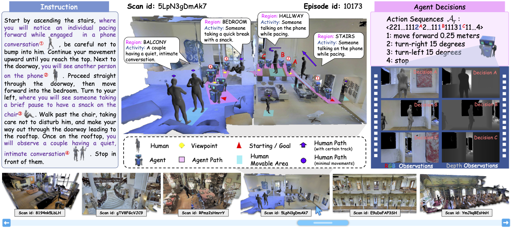

# Human-Aware Vision-and-Language Nagivation (HA-VLN)
 

* [Project Web Page](https://havln-project-website.vercel.app/)
* [Dataset](https://www.dropbox.com/scl/fo/6ofhh9vw5h21is38ahhgc/AOutW4EK3higqNOrX2hQ8rk?rlkey=gvvqy4lsusthzwt9974kkyn7s&st=7l5drspw&dl=0)

<div align="center">
  
</div>

Vision-and-Language Navigation (VLN) is crucial for enabling robots to assist humans in everyday environments. However, current VLN systems lack social awareness and rely on simplified instructions with static environments, limiting Sim2Real realizations. To narrow these gaps, we present Human-Aware Vision-and-Language Navigation (**HA-VLN**), expanding VLN to include both discrete (**HA-VLN-DE**) and continuous (**HA-VLN-CE**) environments with social behaviors. The HA-VLN Simulator enables real-time rendering of human activities and provides unified environments for navigation development. It introduces the Human Activity and Pose Simulation (**HAPS**) **Dataset 2.0** with detailed 3D human motion models and the HA Room-to-Room (**HA-R2R**) Dataset with complex navigation instructions that include human activities. We propose an HA-VLN Vision-and-Language model (**HA-VLN-VL**) and a Cross-Model Attention model (**HA-VLN-CMA**) to address visual-language understanding and dynamic decision-making challenges. Comprehensive evaluations and analysis show that dynamic environments with human activities significantly challenge current systems, highlighting the need for specialized human-aware navigation systems for real-world deployment.

## Table of Contents

- [HA-VLN-CE](#ha-vln-ce)
  - [Table of Contents](#-table-of-contents)
  - [🚀 Quick Start](#-quick-start)
  - [📥 Download Dataset](#-download-dataset)
  - [🔄 Dataset Organization](#-dataset-organization)
  - [🌆 Human-Scene Fusion](#-human-scene-fusion)
  - [🖥️ Real-time Human Rendering](#-real-time-human-rendering)
  - [📊 Training](#-training)
  - [📈 Visualization](#-visualization)

---

## 🚀 Quick Start
```bash
git clone https://github.com/F1y1113/HAVLN-CE.git
cd HAVLN-CE
```
Set up a Conda environment for the simulator.
Please install habitat-lab (v0.1.7) and habitat-sim (v0.1.7) follow [ETPNav](https://github.com/MarSaKi/ETPNav/) (please note that we use python==3.7).
```bash
conda create -n havlnce python=3.7
conda activate havlnce

conda install -c aihabitat -c conda-forge habitat-sim=0.1.7 headless

git clone --branch v0.1.7 git@githubcom:facebookresearch/habitat-lab.git
cd habitat-lab
python setup.py develop --all # install habitat and habitat_baselines
cd ..
```

And follow [GroundingDINO](https://github.com/IDEA-Research/GroundingDINO/) to install GroundDINO (please note that we use supervision==0.11.1).

```bash
git clone https://github.com/IDEA-Research/GroundingDINO.git
cd GroundingDINO/
pip install -e .

mkdir weights
cd weights
wget -q https://github.com/IDEA-Research/GroundingDINO/releases/download/v0.1.0-alpha/groundingdino_swint_ogc.pth
cd ../..
```
Finally, you should install necessary packages for Agent (please see Agent part).

---

## 📥 Download Dataset

To use the simulator, download the [Matterport3D Dataset](https://niessner.github.io/Matterport/) (access required).

```bash
python2 download_mp.py -o Data/scene_datasets --type matterport_mesh house_segmentations region_segmentations poisson_meshes
```

To download and extract HA-R2R and HAPS 2.0 datasets, simply run:

```bash
bash scripts/download_data.sh
```
---

## 🔄 Dataset Organization

- Data
  - HA-R2R
    - train
    - val_seen
    - val_unseen
  - HAPS2.0
    - balcony:A_child_excitedly_greeting_a_pet._0
    - balcony:A_couple_having_a_quiet,_intimate_conversation._0
    - ......
  - ddppo-models
  - scene_datasets

---

## 🌆 Human-Scene Fusion

 We use nine cameras to observe whether there are unreasonable phenomena such as levitation and wearing molds on humans who join the scene. 
 You need to modify the path in [here](https://github.com/F1y1113/HAVLN-CE/blob/main/HASimulator/human_scene_fusion.py).
 ```
data_path = "path/to/glb"
output_path = "test/"
json_path = "path/to/human_info"
 ```

---

## 🖥️ Real-time Human Rendering

Human Rendering is defined in the class **HAVLNCE** of [HASimulator/enviorments.py](https://github.com/F1y1113/HAVLN-CE/blob/main/HASimulator/environments.py).

Human Rendering uses child threads for timing and the main thread for adding, adding and recalculating the required navmesh in real time.


To enable human rendering, you should follow these setting in [vlnce task config](https://github.com/F1y1113/HAVLN-CE/blob/main/Agent/VLN-CE/habitat_extensions/config/vlnce_task.yaml).
```
SIMULATOR:
  ADD_HUMAN: True
  HUMAN_GLB_PATH: path/to/load/motion
  HUMAN_INFO_PATH: path/to/load/human/info
  RECOMPUTE_NAVMESH_PATH: path/to/save/navmesh
```
---

## 📊 Training

 To train the agent of VLN-CE, you can use the script in orignal VLN-CE.
 ```bash
 cd agent
 python run_VLNCE.py \
  --exp-config path/to/experiment_config.yaml \
  --run-type {train | eval | inference}
 ```

## 📈 Visualization

**We present several annotated instances of human subjects from the proposed HAPS 2.0 Dataset (Overall and single), showcasing a variety of well-aligned motions, movements, and interations.** 

<div align="center">
  
</div>


**Overall View of Nine Annoated Scenarios from HA-VLN Simulator (90 scans in total)** 

<div align="center">
  
</div>

**Single Humans with Movements (910 Humans in total)** 

Demo 1|Demo 2|Demo 3
--|--|--
||


Demo 4|Demo 5|Demo 6
--|--|--
||

**Navigation Visualization**

Navigation Demo 1|Navigation Demo 2
--|--
|
**Navigation Instruction**: Start by moving forward in the lounge area, where an individual is engaged in a phone conversation while pacing back and forth. Navigate carefully to avoid crossing their path. As you proceed, you will pass by a television mounted on the wall. Continue your movement, observing people relaxing and watching the TV, some seated comfortably on sofas. Further along, notice a group of friends raising their glasses in a toast, enjoying cocktails together. Maintain a steady course, ensuring you do not disrupt their gathering. Finally, reach the end of your path where a potted plant is situated next to a door. Stop at this location, positioning yourself near the plant and door without obstructing access.|**Navigation Instruction**: Exit the room and make a left turn. Proceed down the hallway where an individual is ironing clothes, carefully smoothing out wrinkles on garments. Continue walking and make another left turn. Enter the next room, which is a bedroom. Inside, someone is comfortably seated in bed, engrossed in reading a book. Move past the bed, ensuring not to disturb the reader. Turn left again to enter the bathroom. Once inside, position yourself near the sink and wait there, observing the surroundings without interfering with any activities.

## Contributing

We welcome contributions to this project! Please see our [CONTRIBUTING.md](CONTRIBUTING.md) file for detailed guidelines on how to contribute.

## License

This project is licensed under the MIT License. For more details, see the [LICENSE](LICENSE) file.

---

